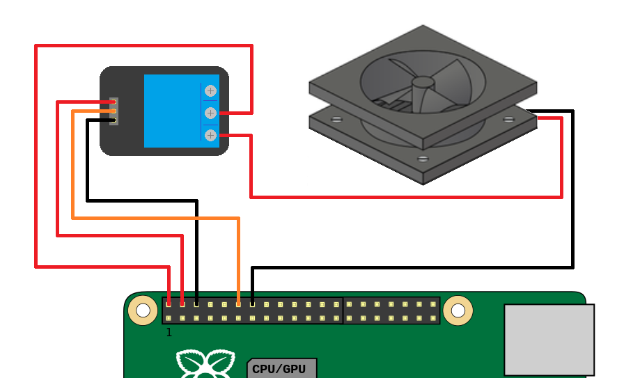

# cooler-fan-pi
Turns on/off the cooler fan using raspberry pi GPIO


## Requirements
- A Raspberry Pi running Raspbian OS
- A cooler fan / old PC fan
- Normally open relay switch


## Wiring
GND of the relay and fan are connected directly to the GPIO.
5 Volts GPIO pins supply the relay directly and the fan via relay's COM pin.
VCC of the fan is connected to the NO relay's pin.
Finally IN relapy's pin is connected to the 18 pin of the GPIO.




## How it works
You can run run-fan.py script manually but is better run it on system startup.
Create a Raspbian background service with systemd.
Open the terminal and run following command:
```
sudo systemctl --force --full edit run-fan.service
```

In the empty editor insert these statements, save them and quit the editor:
```
[Unit]
Description=Turns on the cooler fan with high temperature
After=multi-user.target

[Service]
ExecStart=/usr/bin/python3 /home/pi/run-fan.py

[Install]
WantedBy=multi-user.target
```

*NOTE: please replace "/home/pi/run-fan.py" with the full path of run-fan.py script.*
